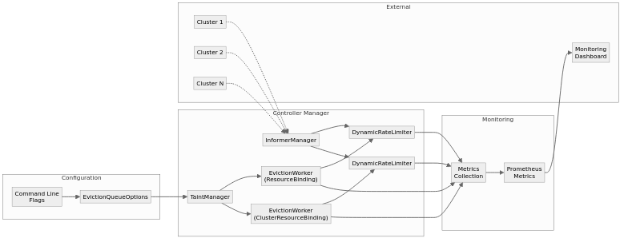

# Eviction Queue with Dynamic Rate Limiting

## Summary

This proposal introduces a dynamic rate limiting mechanism for Karmada's cluster-level fault migration functionality. By implementing dynamic rate control for eviction queues, the system can automatically adjust resource eviction rates based on the overall health status of clusters, preventing cascading failures during large-scale cluster failures. This feature is part of the "Optimize Cluster Failover" major proposal, aimed at improving the stability and controllability of cluster-level fault migration in multi-cluster environments.

## Motivation

In the current version of Karmada, the cluster fault migration functionality has been significantly improved: it no longer automatically triggers migration after cluster failures, but instead allows users to explicitly control whether to enable cluster fault migration through the Failover FeatureGate. However, when the failover functionality is enabled, if multiple clusters fail simultaneously or the proportion of failed clusters is high, the system may still face the following challenges:

1. **Cascading Failure Risk**: When many clusters fail simultaneously, the system will evict a large number of resources to the remaining healthy clusters, potentially causing overload of healthy clusters and triggering cascading failures.

2. **Control Plane Pressure**: Large numbers of concurrent eviction operations can put enormous pressure on the Karmada control plane, affecting overall system stability.

3. **Lack of Adaptive Capability**: The current system lacks the ability to dynamically adjust eviction rates based on the overall health status of clusters, and cannot automatically slow down or pause evictions when system pressure is high.

4. **Insufficient Observability**: Lack of effective monitoring metrics for eviction queue status and system health, making it difficult for administrators to understand system behavior during failure scenarios.

### Goals

- Implement a dynamic rate-limited eviction queue based on cluster health status for cluster-level fault migration functionality
- Provide multi-level rate configuration, supporting automatic adjustment of eviction rates based on the proportion of failed clusters
- Enhance system observability, providing monitoring metrics for eviction queues and cluster health status
- Support configuration of eviction rates and health thresholds through command-line parameters

### Non-Goals

- Handling application-level failover (e.g., pod-level restarts, application crashes, workload-specific remediation)
- Supporting rate limiting strategies beyond cluster health status (e.g., time-based rate limiting, user-defined rate limiting, resource-type-specific rate limiting)

## Proposal

This proposal introduces a dynamic rate-limited eviction queue that automatically adjusts resource eviction rates based on the overall health status of clusters. When the proportion of failed clusters is high, the system will automatically reduce eviction rates or pause evictions to prevent cascading failures.

### User Stories

#### Story 1: Preventing Cascading Failures During Large-Scale Outages

As a cluster administrator, I want to ensure that when multiple clusters experience failures simultaneously, the system doesn't overwhelm the remaining healthy clusters with too many evictions at once. The dynamic rate limiting should automatically slow down or pause evictions when a significant portion of clusters becomes unhealthy.

#### Story 2: Monitoring Eviction Performance

As a cluster administrator, I want to monitor the situation of the eviction queue, including the number of pending evictions, processing latency, and success/failure rates. This information helps me understand the system's behavior during failure scenarios and tune the configuration accordingly.

#### Story 3: Configuring Eviction Behavior for Different Production Environments

As a cluster administrator, I want to configure the eviction behavior based on my production environment's characteristics. For example, in a production environment with many critical workloads and strict SLA requirements, I might want to be more conservative with evictions to ensure stability, while in a production environment with high availability requirements, I might prioritize quick recovery and faster eviction rates.

## Workflow



1. **Cluster Failure Detection**: The system continuously monitors cluster health status through the InformerManager
2. **Resource Identification**: When a cluster becomes unhealthy, the TaintManager identifies all resources that need to be evicted from that cluster
3. **Queue Enqueue**: Resources are added to the appropriate eviction queue (ResourceBinding or ClusterResourceBinding) based on their type
4. **Rate Calculation**: The DynamicRateLimiter calculates the appropriate processing rate based on the current cluster health ratio
5. **Resource Processing**: Resources are processed from the queue at the calculated rate, ensuring smooth operation
6. **Metrics Collection**: Throughout the process, comprehensive metrics are collected and exposed to Prometheus for monitoring

**Rate Adjustment Triggers:**
- **Health Improvement**: When cluster health improves, the rate limiter automatically increases the processing rate
- **Health Deterioration**: When more clusters fail, the rate limiter reduces or pauses processing to prevent cascading failures
- **Threshold Crossing**: Rate adjustments are triggered when crossing predefined health thresholds

## Design Details

The implementation consists of several components:

### 1. EvictionQueueOptions

A configuration structure that controls the behavior of the eviction queue:

- `ResourceEvictionRate`: The default eviction rate (per second) when the system is healthy
- `SecondaryResourceEvictionRate`: The reduced eviction rate when the system is unhealthy
- `UnhealthyClusterThreshold`: The threshold above which the system is considered unhealthy
- `LargeClusterNumThreshold`: The threshold that determines whether to reduce or pause evictions

These options can be configured through command-line flags.

### 2. EvictionQueue

The eviction queue is designed with the following principles to ensure smooth operation:

- **Smooth Processing**: Resources are processed at a controlled rate to prevent overwhelming the system
- **Priority-based Ordering**: Resources are processed in FIFO order with respect to their enqueue time
- **Graceful Degradation**: When system pressure is high, the queue automatically slows down processing
- **Resource Separation**: Different types of resources  (ResourceBinding and ClusterResourceBinding) are placed in different eviction queues

#### 3. DynamicRateLimiter

A dynamic rate limiter that dynamically adjusts eviction rates based on cluster health status. The DynamicRateLimiter consists of several interconnected modules:

1. **Health Monitor**
   - Continuously monitors cluster health status through InformerManager
   - Tracks cluster states (Ready/NotReady) and health metrics
   - Maintains a real-time health ratio calculation
   - Provides health status events to other modules

2. **Rate Calculator**
   - Implements the rate calculation algorithm based on cluster health ratio
   - Supports multiple rate levels (normal, secondary, paused)
   - Handles threshold-based rate transitions
   - Provides rate recommendations to the processing module

3. **Processing Controller**
   - Manages the actual rate limiting implementation
   - Controls resource processing frequency
   - Handles rate transitions and smoothing
   - Ensures rate limits are respected across all eviction workers

### 4. Metrics Collection

A set of metrics for monitoring the eviction queue and cluster health:

- Queue depth metrics
- Resource kind metrics
- Processing latency metrics
- Success/failure metrics
- Cluster health metrics

### Component Interactions

1. The controller manager initializes the TaintManager with EvictionQueueOptions
2. The TaintManager creates two EvictionQueue instances, one for ResourceBinding and one for ClusterResourceBinding
3. Each EvictionQueue uses a DynamicRateLimiter that monitors cluster health
4. When resources need to be evicted, they are added to the appropriate queue
5. The DynamicRateLimiter adjusts the processing rate based on cluster health
6. Metrics are collected throughout the process and exposed to Prometheus for monitoring

## Multi-Rate Configuration

How does the eviction queue control the rate of resource eviction? Drawing inspiration from Kubernetes' node-controller method for controlling node taint addition rates, this proposal introduces the following control parameters in the karmada-controller-manager component:

- `resource-eviction-rate`: Number of resources to be evicted per second, default value is 0.5, meaning one resource is evicted every 2 seconds
- `secondary-resource-eviction-rate`: Secondary resource eviction rate. When there are too many cluster failures in the Karmada instance, the resource eviction rate will be reduced to this secondary level, default value is 0.1
- `unhealthy-cluster-threshold`: Cluster unhealthy threshold, default value is 0.55. That is, when the number of cluster failures in the Karmada instance exceeds 55%, the Karmada instance is considered unhealthy
- `large-cluster-num-threshold`: Large-scale threshold for the Karmada instance, default value is 10. When the number of clusters in the Karmada instance exceeds this threshold, the Karmada instance is considered a large-scale federation. When the number of failed clusters in a large-scale federation exceeds 55%, the resource eviction rate will be reduced to 0.1; for small-scale federations, the rate will be directly reduced to 0, meaning eviction is stopped

## Eviction Queue Observability

This proposal adds the following metrics for the eviction queue, following Karmada project's metric design patterns, providing complete observability through basic metrics and PromQL queries:

### Basic Metrics

- `eviction_total`: Number of elements in the queue, with labels:
  - `queue_name`: Identifies the queue name, facilitating distinction between different queues
- `evict_kind_total`: Number of different types of elements in the queue, with labels:
  - `cluster_name`: Identifies the cluster from which the resource is being evicted.
  - `resource_kind`: Marks the type of enqueued resources, concatenated from the resource's APIVersion and Kind
- `eviction_processing_latency_seconds`: Time interval from enqueueing to processing of resources, with labels:
  - `queue_name`: Identifies the queue name, facilitating distinction between different queues
- `eviction_processing_total`: Total number of processing attempts, with labels:
  - `queue_name`: Identifies the queue name, facilitating distinction between different queues
  - `result`: Processing result, with values "success" or "error"
- `cluster_fault_num`: Number of failed clusters
- `cluster_failure_rate`: Failure rate of clusters in the Karmada instance

### Derived Metrics (Calculated via PromQL)

The following metrics can be obtained through PromQL queries without additional exposure:

**Processing Rate:**
```promql
# Processing rate per second
rate(eviction_processing_total[5m])

# Processing rate grouped by queue
rate(eviction_processing_total{queue_name="resource-binding"}[5m])
rate(eviction_processing_total{queue_name="cluster-resource-binding"}[5m])
```

**Success Rate:**
```promql
# Overall success rate
sum(rate(eviction_processing_total{result="success"}[5m])) / sum(rate(eviction_processing_total[5m]))

# Success rate grouped by queue
sum(rate(eviction_processing_total{queue_name="resource-binding",result="success"}[5m])) / sum(rate(eviction_processing_total{queue_name="resource-binding"}[5m]))
```

**Failure Rate:**
```promql
# Overall failure rate
sum(rate(eviction_processing_total{result="error"}[5m])) / sum(rate(eviction_processing_total[5m]))
```

**Queue Status Monitoring:**
```promql
# Current queue depth
eviction_total

# Number of queued items grouped by resource type
evict_kind_total
```

**Cluster Health Status:**
```promql
# Number of failed clusters
cluster_fault_num

# Cluster failure rate
cluster_failure_rate
```

This design pattern is consistent with other metrics in the Karmada project, providing raw data through basic counters and histograms, allowing users to flexibly calculate required derived metrics through PromQL.

## Implementation Details

### New Files

1. **pkg/controllers/cluster/evictionqueue_config/evictionoption.go**
   - Defines the EvictionQueueOptions structure and methods to register command-line flags

2. **pkg/controllers/cluster/eviction_queue.go**
   - Implements the EvictionQueue interface and concrete evictionQueue type
   - Provides methods for adding items to the queue and processing them
   - Integrates with metrics collection

3. **pkg/controllers/cluster/dynamic_rate_limiter.go**
   - Implements the DynamicRateLimiter type
   - Provides methods for calculating the appropriate rate based on cluster health
   - Updates cluster health metrics

### Modifications to Existing Files

1. **pkg/controllers/cluster/taint_manager.go**
   - Add EvictionQueueOptions and InformerManager fields to NoExecuteTaintManager
   - Modify the Start method to create and start eviction workers
   - Add getResourceKindFromKey method to extract cluster name and resource kind
   - Update syncCluster, syncBindingEviction, and syncClusterBindingEviction methods

2. **pkg/metrics/cluster.go**
   - Add metrics for eviction queue depth, processing latency, and success/failure rates
   - Add metrics for cluster health status
   - Add methods for recording metrics

3. **cmd/controller-manager/app/options/options.go**
   - Add EvictionQueueOptions field to Options structure
   - Register command-line flags for eviction queue options

4. **cmd/controller-manager/app/controllermanager.go**
   - Pass EvictionQueueOptions to TaintManager when creating it
   - Pass EvictionQueueOptions to controller context

5. **pkg/controllers/context/context.go**
   - Add EvictionQueueOptions field to Options structure

## Test Plan

### Unit Tests

1. **EvictionQueue Tests**
   - Test queue enqueue/dequeue operations
   - Test rate limiting functionality
   - Test metrics collection
   - Test error handling and recovery

2. **DynamicRateLimiter Tests**
   - Test rate calculation algorithms
   - Test threshold evaluation logic
   - Test rate adjustment mechanisms
   - Test cluster health monitoring

3. **Configuration Tests**
   - Test command-line flag parsing
   - Test default value handling
   - Test validation logic


## Implementation Plan

1. Implement EvictionQueueOptions structure and command-line flags
2. Implement DynamicRateLimiter
3. Implement EvictionWorker
4. Add metrics collection
5. Modify TaintManager to use the eviction queue


## Open Issues

The current design sets up two independent eviction queues for ResourceBinding and ClusterResourceBinding. While this aligns with the existing taint-manager architecture, using a single queue for all resource types might be more efficient. This would require more significant changes to the taint-manager but could be considered in the future.

